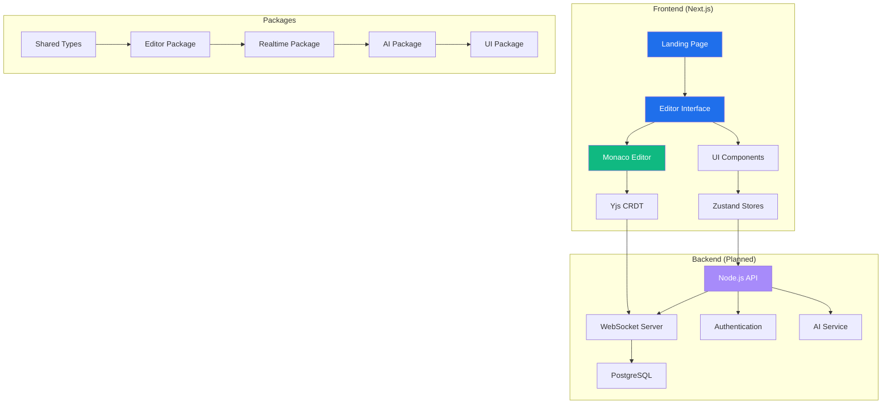

# 🚀 Velonus - Real-Time Collaborative Coding Platform

<div align="center">


**Professional real-time collaborative coding platform with AI-powered assistance, role-based pair programming, and enterprise-grade conflict resolution.**

[](https://www.typescriptlang.org/)
[](https://nextjs.org/)
[](https://reactjs.org/)
[](https://microsoft.github.io/monaco-editor/)
[](https://tailwindcss.com/)

</div>

---

## 📋 Table of Contents

- [🎯 Project Vision](#-project-vision)
- [✅ Current Status](#-current-status)
- [🏗️ Architecture Overview](#️-architecture-overview)
- [🎨 Design System](#-design-system)
- [📦 What's Been Built](#-whats-been-built)
- [🔧 Technical Decisions](#-technical-decisions)
- [🚀 Getting Started](#-getting-started)
- [📱 Features Implemented](#-features-implemented)
- [🗺️ Roadmap](#️-roadmap)
- [🤝 Contributing](#-contributing)

---

## 🎯 Project Vision

Velonus aims to be the **Google Docs of code editing** - a production-ready, enterprise-grade collaborative coding platform that enables seamless real-time collaboration with AI assistance. Unlike existing solutions, Velonus focuses on:

### **Core Mission**
- **Zero-Conflict Collaboration**: Using CRDT (Conflict-free Replicated Data Types) for true real-time editing
- **Role-Based Pair Programming**: Driver, Navigator, Observer, and AI Assistant roles
- **AI-Powered Development**: GPT-4o integration for intelligent code assistance
- **Enterprise Ready**: SOC 2 compliance, session playback, and team management

### **Target Users**
- **Development Teams** looking for better pair programming tools
- **Code Review Teams** needing collaborative review environments  
- **Educational Institutions** teaching programming collaboratively
- **Enterprise Organizations** requiring secure, scalable collaboration

---

## ✅ Current Status

### **🟢 Completed (Production Ready)**
- ✅ **Monorepo Architecture** - Turbo-powered build system
- ✅ **Core Type System** - Comprehensive TypeScript interfaces
- ✅ **Modern UI/UX** - Professional dark theme with glass morphism
- ✅ **Landing Page** - Enterprise-grade marketing site
- ✅ **Editor Foundation** - Monaco + Yjs integration setup
- ✅ **Real-time Infrastructure** - WebSocket provider configuration
- ✅ **Role-Based System** - Driver/Navigator/Observer/AI roles
- ✅ **Zoom Functionality** - Professional zoom controls with persistence
- ✅ **State Management** - Zustand stores for editor and collaboration

### **🟡 In Progress**
- 🔄 **Backend API** - Node.js server structure created, implementation pending
- 🔄 **Authentication** - Clerk integration planned
- 🔄 **AI Integration** - OpenAI GPT-4o setup pending

### **🔴 Planned**
- ⏳ **Database Layer** - PostgreSQL/Supabase integration
- ⏳ **Session Management** - Real-time session persistence
- ⏳ **Branch & Merge** - Visual diff and conflict resolution
- ⏳ **Chat System** - Inline comments and text chat
- ⏳ **Mobile Support** - Responsive design enhancements

---

## 🏗️ Architecture Overview



### **Technology Stack**

#### **Frontend**
- **Framework**: Next.js 14 with App Router
- **Language**: TypeScript (strict mode)
- **Styling**: Tailwind CSS with custom design system
- **Editor**: Monaco Editor (VS Code engine)
- **Real-time**: Yjs CRDT with WebSocket provider
- **State**: Zustand for client-side state management

#### **Monorepo Structure**
```
Velonus/
├── apps/
│   ├── web/                 # Next.js frontend application
│   └── api/                 # Node.js backend (planned)
├── packages/
│   ├── shared/              # Common types and utilities
│   ├── editor/              # Collaborative editor package
│   ├── realtime/            # Real-time sync utilities
│   ├── ai/                  # AI integration package
│   └── ui/                  # Shared UI components
└── tooling/
    ├── turbo.json           # Turbo build configuration
    └── tsconfig.json        # Root TypeScript config
```

#### **Backend (Architecture)**
- **Runtime**: Node.js with Express/Fastify
- **Database**: PostgreSQL with Supabase
- **Authentication**: Clerk.dev
- **Real-time**: Socket.IO + Yjs WebSocket provider
- **AI**: OpenAI GPT-4o API integration
- **Hosting**: Vercel (frontend) + Railway/Render (backend)

---

## 🎨 Design System

### **Visual Identity**
- **Theme**: Modern Dark (GitHub-inspired)
- **Primary**: Electric Blue (#1F6FEB)
- **Background**: GitHub Dark (#0D1117)
- **Typography**: Inter + JetBrains Mono
- **Effects**: Glass morphism, neon glows, smooth animations

### **Role-Based Color System**
```css
🚗 Driver:    #1F6FEB (Electric Blue)   - Full editing privileges
🧭 Navigator: #10B981 (Soft Green)      - Guidance and suggestions  
👀 Observer:  #6B7280 (Gray)            - View-only access
🤖 AI:        #A78BFA (Soft Purple)     - AI assistant interactions
```

### **Component Design Philosophy**
- **Professional**: Enterprise-grade visual hierarchy
- **Accessible**: WCAG compliant with proper focus states
- **Responsive**: Mobile-first with progressive enhancement
- **Performant**: CSS-in-JS avoided, pure Tailwind approach

---

## 📦 What's Been Built

### **1. Monorepo Foundation**
**Why**: Scalable architecture for multiple apps and shared packages
```typescript
// Turbo-powered build system
- Shared TypeScript configs with project references
- Optimized build caching and dependency management
- Hot reload across all packages during development
```

### **2. Comprehensive Type System**
**Why**: Type safety prevents runtime errors in collaborative environments
```typescript
// packages/shared/src/types/
- User management with preferences and profiles
- Session types with role-based permissions
- Workspace and project organization
- Real-time event typing for WebSocket communication
```

### **3. Collaborative Editor Core**
**Why**: Monaco + Yjs provides VS Code experience with conflict-free collaboration
```typescript
// packages/editor/src/components/CollaborativeEditor.tsx
- Monaco Editor integration with Yjs CRDT
- Real-time cursor and selection tracking
- Role-based edit permissions
- Zoom functionality with persistence
- Keyboard shortcut handling
```

### **4. Modern Landing Page**
**Why**: Professional first impression for enterprise adoption
```typescript
// apps/web/src/app/page.tsx
- Hero section with compelling value proposition
- Feature showcase with role-based demonstrations
- Enterprise trust indicators (SOC 2, uptime, etc.)
- Technology stack transparency
```

### **5. Professional UI Components**
**Why**: Consistent, accessible interface across all features
```typescript
// packages/editor/src/components/
- EditorToolbar: Session info, participants, zoom controls
- RoleIndicator: Real-time role badges with neon styling
- CursorWidget: Live cursor tracking with user identification
- ZoomControls: Professional zoom with 50%-300% range
```

### **6. State Management Architecture**
**Why**: Predictable state updates in collaborative environment
```typescript
// packages/editor/src/stores/
- editorStore: Editor preferences, zoom, content state
- collaborationStore: Participants, connection status, roles
- Zustand chosen for simplicity and TypeScript integration
```

---

## 🔧 Technical Decisions

### **Monaco Editor vs. CodeMirror**
**Decision**: Monaco Editor  
**Reasoning**: 
- Same engine as VS Code (familiar UX)
- Better TypeScript/language support out of the box
- Superior performance with large files
- Extensive plugin ecosystem

### **Yjs vs. ShareJS vs. Custom CRDT**
**Decision**: Yjs  
**Reasoning**:
- Mature, battle-tested CRDT implementation
- Excellent Monaco Editor bindings
- Strong WebSocket provider support
- Active community and documentation

### **Zustand vs. Redux vs. Context**
**Decision**: Zustand  
**Reasoning**:
- Minimal boilerplate compared to Redux
- Excellent TypeScript support
- No provider hell like Context
- Perfect for real-time state updates

### **Tailwind vs. Styled Components vs. CSS Modules**
**Decision**: Tailwind CSS  
**Reasoning**:
- Faster development with utility classes
- Consistent design system enforcement
- Better performance (no CSS-in-JS runtime)
- Easier maintenance and refactoring

### **Turbo vs. Lerna vs. Nx**
**Decision**: Turbo  
**Reasoning**:
- Superior build caching and speed
- Simpler configuration than Nx
- Better developer experience than Lerna
- Vercel integration benefits

---

## 🚀 Getting Started

### **Prerequisites**
```bash
- Node.js 18+ 
- npm 9+
- Git
```

### **Installation**
```bash
# Clone the repository
git clone https://github.com/aliammar15/velonus.git
cd velonus

# Install dependencies
npm install

# Start development server
npm run dev
```

### **Available Scripts**
```bash
npm run dev          # Start all development servers
npm run build        # Build all packages and apps
npm run test         # Run all tests
npm run lint         # Lint all packages
npm run type-check   # TypeScript type checking
```

### **Development URLs**
- **Frontend**: http://localhost:3000
- **API**: http://localhost:3001 (when implemented)
- **Storybook**: http://localhost:6006 (planned)

---

## 📱 Features Implemented

### **✅ Real-Time Editor**
- Monaco Editor with syntax highlighting for 20+ languages
- Yjs CRDT for conflict-free collaborative editing
- Live cursor tracking with user identification
- Role-based editing permissions (Driver/Navigator/Observer/AI)

### **✅ Zoom Functionality**
- Professional zoom controls (50% - 300%)
- Keyboard shortcuts (Ctrl/Cmd + Plus/Minus/0)
- Persistent zoom preferences via localStorage
- Dynamic font size calculation

### **✅ Professional UI**
- GitHub Dark theme with glass morphism effects
- Responsive design with mobile considerations
- Accessibility-compliant focus states
- Smooth animations and micro-interactions

### **✅ Session Management**
- Session ID generation and tracking
- User role assignment and switching
- Connection status indicators
- Participant list with live presence

### **✅ Modern Development Setup**
- TypeScript strict mode with project references
- ESLint + Prettier for code quality
- Hot reload across all packages
- Optimized build pipeline with Turbo

---

## 🗺️ Roadmap

### **Phase 1: Core Backend (Next 2-4 weeks)**
- [ ] **WebSocket Server**: Real-time sync infrastructure
- [ ] **Authentication**: Clerk integration with user management
- [ ] **Database Schema**: PostgreSQL tables for sessions, users, workspaces
- [ ] **Session Persistence**: Save/restore collaborative sessions

### **Phase 2: AI Integration (Weeks 4-6)**
- [ ] **OpenAI Integration**: GPT-4o API setup
- [ ] **Code Assistance**: Explain, refactor, suggest improvements
- [ ] **AI Chat Interface**: Inline AI conversations
- [ ] **Smart Suggestions**: Context-aware code completion

### **Phase 3: Advanced Collaboration (Weeks 6-10)**
- [ ] **Branching System**: Visual branch creation and switching
- [ ] **Merge Conflicts**: Smart conflict resolution UI
- [ ] **Version History**: Timeline with AI-generated summaries
- [ ] **Session Playback**: Rewind and replay coding sessions

### **Phase 4: Enterprise Features (Weeks 10-14)**
- [ ] **Team Workspaces**: Organization and permission management
- [ ] **Security Audit**: SOC 2 compliance preparation
- [ ] **Performance Optimization**: Large file handling, scalability
- [ ] **Mobile App**: React Native companion app

### **Phase 5: Production Launch (Weeks 14-16)**
- [ ] **Beta Testing**: Closed beta with select development teams
- [ ] **Documentation**: Comprehensive API and user docs
- [ ] **Deployment**: Production infrastructure setup
- [ ] **Marketing**: Launch campaign and community building

---

## 🧪 Testing Strategy

### **Current Testing Setup**
```bash
# Unit Tests (Planned)
- Jest + Testing Library for components
- Vitest for packages and utilities
- MSW for API mocking

# Integration Tests (Planned)  
- Playwright for end-to-end testing
- Real-time collaboration scenarios
- Cross-browser compatibility

# Performance Tests (Planned)
- Large file handling benchmarks
- Concurrent user load testing
- Network latency simulation
```

---

## 🔐 Security Considerations

### **Data Protection**
- **End-to-End Encryption**: All collaborative data encrypted in transit
- **Access Controls**: Role-based permissions with audit trails
- **Session Isolation**: Each session isolated with unique identifiers
- **GDPR Compliance**: User data protection and right to deletion

### **Infrastructure Security**
- **SOC 2 Type II**: Planned compliance certification
- **Regular Audits**: Automated security scanning and penetration testing
- **Secure Hosting**: Vercel (frontend) + Railway/Render (backend)
- **Environment Isolation**: Separate dev/staging/production environments

---

## 🎯 Success Metrics

### **Technical KPIs**
- **Latency**: < 50ms for real-time sync
- **Uptime**: 99.9% availability SLA
- **Performance**: < 2s initial load time
- **Scalability**: 1000+ concurrent users per session

### **User Experience KPIs**
- **Time to First Collaboration**: < 30 seconds
- **User Retention**: > 80% week-over-week
- **Feature Adoption**: > 70% use AI assistance
- **Customer Satisfaction**: > 4.5/5 rating

---

## 🤝 Contributing

### **Development Process**
1. **Fork & Clone**: Fork the repo and clone locally
2. **Feature Branch**: Create feature branch from `main`
3. **Development**: Follow TypeScript strict mode and ESLint rules
4. **Testing**: Add tests for new features
5. **Pull Request**: Create PR with detailed description
6. **Review**: Code review and CI/CD checks
7. **Merge**: Squash and merge to main

### **Code Standards**
- **TypeScript**: Strict mode with explicit types
- **ESLint**: Airbnb config with custom rules
- **Prettier**: Consistent code formatting
- **Commits**: Conventional commits for changelog generation

### **Getting Help**
- **Issues**: Use GitHub issues for bug reports and feature requests
- **Discussions**: Use GitHub discussions for questions and ideas
- **Discord**: Join our developer community (link coming soon)

---

## 📄 License

This project is licensed under the **MIT License** - see the [LICENSE](LICENSE) file for details.

---

## 🙏 Acknowledgments

- **Monaco Editor Team** - For the incredible VS Code editing experience
- **Yjs Community** - For robust CRDT implementation and WebSocket providers
- **Vercel Team** - For Next.js and exceptional developer experience
- **Tailwind Labs** - For the utility-first CSS framework
- **OpenAI** - For GPT-4o API that powers our AI features

---

<div align="center">

**Built with ❤️ by Ali Ammar **


---

**⭐ Star this repo if you find it useful!**

</div> 